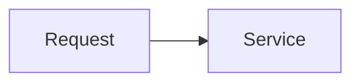

<!-- Title: Brief description -->
<!-- Omit any section below that doesn't apply -->

## What & Root Cause
<!-- What was broken and why? 1-3 sentences -->

## Fix
<!-- What was changed to resolve it? -->

## Services & Areas Changed
-

## Testing
<!-- How was the fix verified? -->

## Breaking Changes
<!-- Describe impact -->

## API Changes
<!-- Show affected class APIs -->

## Diagram
<!-- Optional: illustrate the user flow or architecture with a Mermaid diagram -->
<!--

-->
