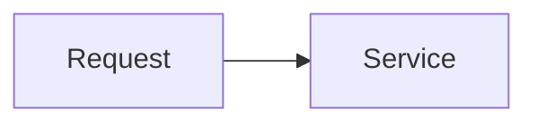

<!-- Title: Brief description -->
<!-- Use for: refactors, dependency updates, config changes, CI/CD, tooling -->
<!-- Omit any section below that doesn't apply -->

## What & Why
<!-- What was done and why? 1-3 sentences -->

## Services & Areas Changed
-

## Testing
<!-- How was correctness verified? -->

## Breaking Changes
<!-- Describe impact and migration steps -->

## Diagram
<!-- Optional: illustrate the user flow or architecture with a Mermaid diagram -->
<!--

-->
