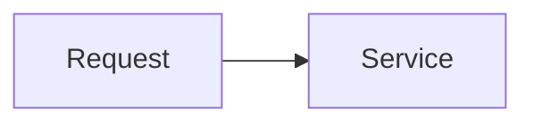

<!-- Title: What was added -->
<!-- Omit any section below that doesn't apply -->

## What
<!-- 1-2 sentences: what does this add or change? -->

## Why
<!-- Why was this needed? What problem does it solve? -->

## Services & Areas Changed
-

## Testing
<!-- Unit tests / integration tests / manual verification -->

## Breaking Changes
<!-- Describe impact and migration steps -->

## API Changes
<!-- Show new or modified class APIs with a usage example -->

## Diagram
<!-- Optional: illustrate the user flow or architecture with a Mermaid diagram -->
<!--

-->
